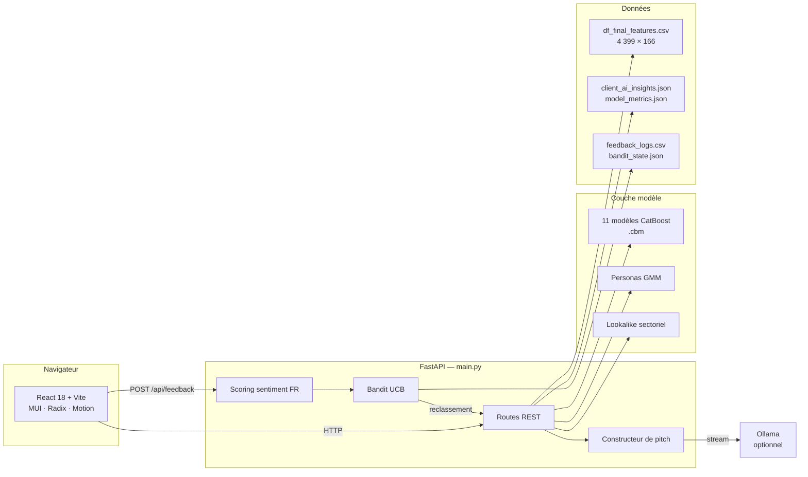
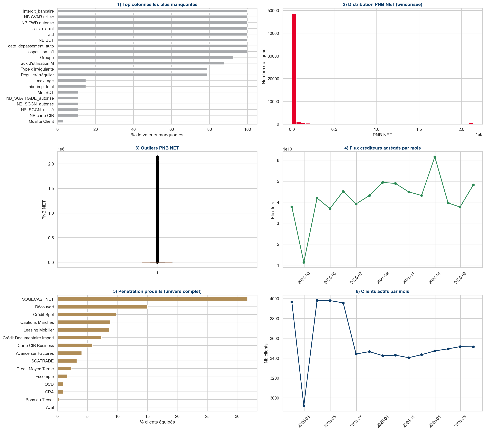
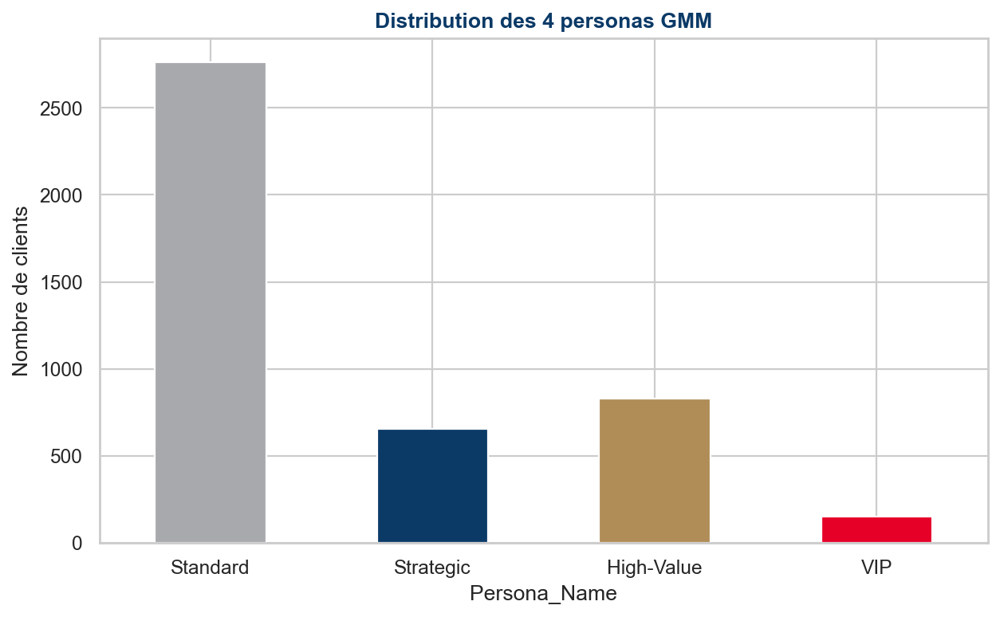
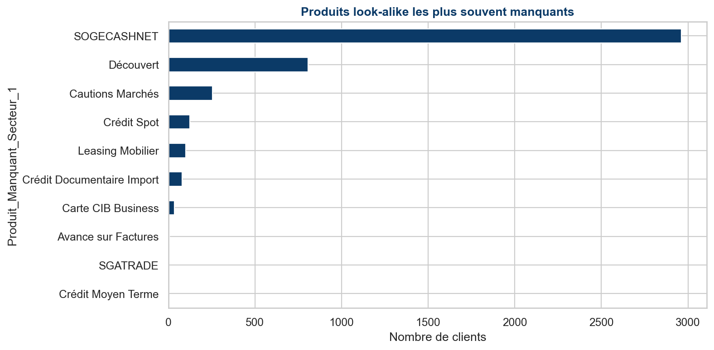

<div align="center">


# SynerG — Sales Intelligence & Retention Engine

### Moteur de recommandation produit et de rétention pour la banque corporate

*17 modèles de propension produit, personas GMM, moteur de lookalike et pitch commercial généré par LLM — le tout servi dans un dashboard de gestion de portefeuille.*

<br/>

[](https://fastapi.tiangolo.com/)
[](https://catboost.ai/)
[](https://python.org)
[](https://react.dev)
[](https://vite.dev)
[](https://render.com)

[](https://syner-g-sga.vercel.app)
[](#-performance-des-modèles)
[](#-performance-des-modèles)
[](#-données)

</div>

---

## Le problème

Un chargé de clientèle corporate gère plusieurs centaines d'entreprises. Il n'a ni le temps ni les outils pour répondre à trois questions à chaque visite :

1. **Quel produit** proposer à *ce* client, maintenant ?
2. **Pourquoi** ce produit — quel argument tient face au dirigeant ?
3. **Quels clients** risquent de partir avant la fin du trimestre ?

SynerG répond aux trois. Le moteur classe 17 produits bancaires par probabilité d'adoption pour chaque client, construit un argumentaire à partir de ses flux réels, et remonte les signaux de churn depuis l'évolution des flux créditeurs.

> **Contexte** — Prototype construit pour la Société Générale Algérie. Les identifiants clients et chargés de relation sont pseudonymisés.

---

## Ce qui rend le projet intéressant techniquement

| | |
|---|---|
| **Propension multi-produit** | 11 modèles CatBoost dédiés + 6 produits en fallback content-based, entraînés sur 166 features par client |
| **Bandit UCB** | Le classement des recommandations s'ajuste en continu selon les retours terrain — l'exploration est bornée par un Upper Confidence Bound |
| **Feedback à double signal** | Chaque retour combine acceptation binaire *et* score de sentiment extrait du commentaire libre en français |
| **Lookalike sectoriel** | Un client sans produit X est comparé à ses pairs du même secteur qui le détiennent — d'où l'argument commercial |
| **Pitch streamé** | Génération d'argumentaire via Ollama en local, streamé token par token, avec fallback déterministe si le LLM est indisponible |
| **Personas GMM** | Segmentation non supervisée par mélange gaussien, croisée avec la segmentation métier existante |

---

## 🏗️ Architecture



---

## 📊 Performance des modèles

AUC sur jeu de test, un modèle binaire par produit. Les produits sous 50 cas positifs basculent sur une stratégie content-based (similarité sectorielle) plutôt que sur un modèle entraîné — un choix assumé pour éviter le sur-apprentissage.

| Produit | Famille | AUC test | Positifs | Taux de base |
|---|---|---:|---:|---:|
| SOGECASHNET | Cash Management | **0.9998** | 1 396 | 31.7 % |
| Carte CIB Business | Cash Management | **0.9915** | 256 | 5.8 % |
| Découvert | Financing / Credit | **0.9909** | 661 | 15.0 % |
| Crédit Spot | Financing / Credit | **0.9882** | 430 | 9.8 % |
| Avance sur Factures | Financing / Credit | **0.9862** | 178 | 4.0 % |
| SGATRADE | Trade Finance | **0.9785** | 141 | 3.2 % |
| Crédit Documentaire Import | Trade Finance | **0.9782** | 323 | 7.3 % |
| Leasing Mobilier | Financing / Credit | **0.9703** | 380 | 8.6 % |
| Escompte | Financing / Credit | **0.9699** | 72 | 1.6 % |
| Cautions Marchés | Financing / Credit | **0.9655** | 390 | 8.9 % |
| Crédit Moyen Terme | Financing / Credit | **0.9397** | 101 | 2.3 % |

<details>
<summary><b>Produits en fallback content-based</b> — 6 produits sous le seuil d'entraînement</summary>

<br/>

| Produit | Famille | Positifs | Taux de base |
|---|---|---:|---:|
| OCD | Trade Finance | 44 | 1.0 % |
| CRA | Trade Finance | 42 | 1.0 % |
| Bons du Trésor | Treasury & Markets | 13 | 0.3 % |
| Aval | Trade Finance | 8 | 0.2 % |
| Crédit-Bail Immobilier | Financing / Credit | 4 | 0.1 % |
| SBLC | Trade Finance | 2 | 0.0 % |

Pour ces produits, la recommandation s'appuie sur la proximité sectorielle et la détention par des clients comparables, sans modèle supervisé.

</details>

<details>
<summary><b>Note de lecture sur les AUC</b> — à lire avant de citer ces chiffres</summary>

<br/>

Les AUC très élevés (> 0.99) s'expliquent en partie par des features fortement corrélées à la détention du produit cible dans le jeu de données historique. En production, un protocole de validation temporelle (train sur T, test sur T+1) donnerait des chiffres plus conservateurs et plus honnêtes.

C'est une limite connue du prototype, documentée ici volontairement.

</details>

---

## 🖼️ Analyses

<div align="center">

| EDA initiale | Personas GMM | Produits manquants (lookalike) |
|:---:|:---:|:---:|
|  |  |  |

</div>

> 📹 Une démo vidéo est disponible à la racine du dépôt.

---

## 🔌 API

Base locale : `http://127.0.0.1:8000` · Documentation interactive : `/docs`

| Méthode | Route | Rôle |
|---|---|---|
| `GET` | `/api/health` | Healthcheck |
| `GET` | `/api/clients` | Liste du portefeuille |
| `GET` | `/api/clients/{client_id}` | Fiche client + KPIs |
| `GET` | `/api/managers` | Liste des chargés de relation |
| `GET` | `/api/manager/clients` | Portefeuille filtré, trié, avec synthèse |
| `GET` | `/api/insights/{client_id}` | Recommandations, persona, argumentaire |
| `GET` | `/api/cartography/client/{client_id}` | Positionnement du client |
| `GET` | `/api/cartography/similar/{client_id}` | Top 5 clients lookalike |
| `POST` | `/api/generate-pitch` | Pitch commercial streamé |
| `POST` | `/api/feedback` | Retour terrain → mise à jour du bandit |

---

## 🚀 Installation

<details open>
<summary><b>Backend — FastAPI</b></summary>

```bash
python -m pip install -r requirements.txt
uvicorn main:app --reload
```

</details>

<details open>
<summary><b>Frontend — React / Vite</b></summary>

```bash
cd "Premium Banking Dashboard Design"
npm install
npm run dev
```

</details>

<details>
<summary><b>Variables d'environnement</b></summary>

<br/>

| Variable | Portée | Défaut | Rôle |
|---|---|---|---|
| `VITE_API_BASE_URL` | Frontend | `http://127.0.0.1:8000` | URL du backend |
| `VITE_ENABLE_LOCAL_PITCH` | Frontend | `false` | Active le module de pitch LLM |
| `OLLAMA_BASE_URL` | Backend | `http://localhost:11434` | Instance Ollama |
| `OLLAMA_MODEL` | Backend | — | Modèle de génération |

Aucune variable n'est obligatoire : sans Ollama, l'application reste pleinement fonctionnelle et le pitch bascule sur un générateur déterministe.

</details>

<details>
<summary><b>Déploiement</b></summary>

<br/>

**Backend — Render.** Le dépôt contient `render.yaml` :

```yaml
buildCommand: pip install -r requirements.txt
startCommand: uvicorn main:app --host 0.0.0.0 --port $PORT
```

**Frontend — Vercel.** Le dépôt contient `vercel.json`. Le `package.json` racine agit comme monorepo léger : `postinstall` installe les dépendances du sous-dossier, `build` lance `vite build`.

Renseigner sur Vercel :

```
VITE_API_BASE_URL=https://votre-backend.onrender.com
```

</details>

---

## 📁 Structure

```
SynerG-SGA/
├── main.py                              # API FastAPI — routes, bandit, pitch, scoring
├── catboost_models/                     # 11 modèles .cbm exportés
├── df_final_features.csv                # 4 399 clients × 166 features
├── client_ai_insights.json              # Recommandations, personas, fiches visite
├── model_metrics.json                   # AUC, taux de base, stratégie par produit
├── exported_model_manifest.json         # Colonnes attendues par modèle
├── bandit_state.json                    # État persisté du bandit UCB
├── feedback_logs.csv                    # Journal des retours terrain
├── dza.geojson                          # Découpage wilayas pour la cartographie
├── SGA_Sales_Intelligence_..._v2.ipynb  # Notebook d'entraînement et d'analyse
└── Premium Banking Dashboard Design/    # SPA React + Vite
    └── src/app/
        ├── pages/                       # Login · Dashboard · ClientList ·
        │                                # ClientDashboard · Cartography · Settings
        └── components/                  # KPICards · CATrendChart · Recommendations ·
                                         # ProductsDonutChart · LLMPitchStream · …
```

---

## ⚠️ Limites connues

<details>
<summary><b>Ce qui ne tiendrait pas en production</b></summary>

<br/>

- **Persistance fichier** — `feedback_logs.csv` et `bandit_state.json` sont écrits sur le disque du conteneur. Acceptable en démo, perdu à chaque redéploiement sur Render. Une vraie mise en production demande PostgreSQL.
- **Pas de validation temporelle** — voir la note de lecture sur les AUC plus haut.
- **Données embarquées** — le CSV est chargé en mémoire au démarrage. Ne passe pas l'échelle au-delà de quelques dizaines de milliers de clients.
- **Pas d'authentification réelle** — l'écran de login est une maquette ; le contrôle d'accès par chargé de relation est appliqué côté API mais sans vérification d'identité.

</details>

---

## 🛠️ Stack complète

**Backend** · FastAPI · Uvicorn · pandas · scikit-learn · CatBoost · httpx · Pydantic
**Frontend** · React 18 · Vite · TypeScript · MUI · Radix UI · Tailwind · Motion · Recharts · jsPDF · html2canvas · react-dnd
**ML** · CatBoost · Gaussian Mixture Models · Bandit UCB · scikit-learn
**Infra** · Render · Vercel · Ollama *(optionnel)*

---

<div align="center">

**Ahcene Zakaria Aouanouk** — Étudiant en Data Science & IA, Alger

[](https://www.linkedin.com/in/ahcene-zakaria-aouanouk-1126902b7/)
[](mailto:zzaouanouk@gmail.com)

</div>
